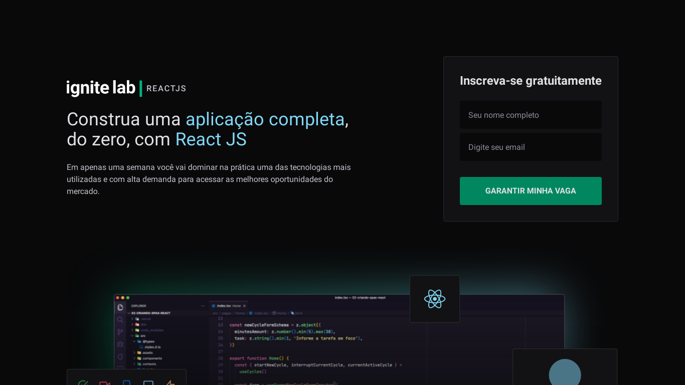

<div align="center">
  
</div>

<div align="center">
  
  
  

  
</div>

---
## 🧪 Technologies

This project was developed using the following technologies:

- [ReactJS](https://reactjs.org/)
- [Vite](https://vitejs.dev/)
- [TailwindCss](https://tailwindcss.com/)
- [GraphQL](https://graphql.org/)
- [GraphQLCodeGen](https://www.graphql-code-generator.com/)
- [GraphCMS](https://graphcms.com/)
- [ReactHookForm](https://react-hook-form.com/)
- [Yup](https://www.npmjs.com/package/yup)

---
## 🚀 Getting started

Clone the project and access the folder.

```bash
git clone https://github.com/NitoBa/ignite-lab-event-platform-app.git

cd event-platform-app
```

Run this command to install the dependencies and add your credentials looks like on the `.env.example` and `codegen.example.yaml`file:

`.env.example`
VITE_API_URL=your-api-url
VITE_AUTH_TOKEN=your-auth-token

`codegen.example.yaml`
schema: your-api-url

---
## 📚 Project execution

```bash
npm install

npm run dev
```

## 🔖 Layout

You can view the layout through the link below:
- [Layout](https://www.figma.com/file/13cKAcZJkkbifxmRs0wOv9/Plataforma-de-evento---Ignite-Lab-(Community)?node-id=24%3A2)

You can view the project through the link below:

- [Live Preview](https://ignite-lab-event-platform-app.vercel.app/)

## 📝 License

This project is licensed under the MIT License. See the [LICENSE](LICENSE) file for details.

---

Made with 💜 by [Bruno Alves](https://nito-dev.vercel.app/) 👋
